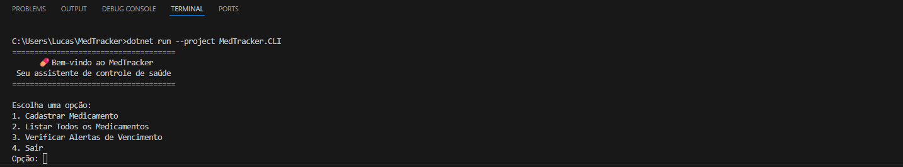

# 💊 MedTracker CLI

> Uma aplicação simples de linha de comando (CLI) para auxiliar no controle e validade de medicamentos, garantindo mais segurança para pacientes e cuidadores.

---

# 1. Nome do projeto
MedTracker CLI

# 2. Descrição do problema real
Cuidadores de idosos e pacientes crônicos enfrentam sérios riscos à saúde devido à falta de controle das datas de validade de medicamentos. O uso acidental de remédios vencidos é um perigo constante, e as ferramentas atuais são muitas vezes complexas demais para o uso rápido no dia a dia.

# 3. Proposta da solução
Uma ferramenta de linha de comando (CLI) minimalista que atua como um validador inteligente. O sistema impede a entrada de medicamentos inválidos (vencidos ou sem nome) e gera alertas proativos para itens que expiram nos próximos 7 dias.

# 4. Público-alvo
Cuidadores familiares, profissionais de saúde domiciliar e pacientes que necessitam de uma ferramenta de inventário simples, técnica e segura para seus medicamentos.

# 5. Funcionalidades principais
- Cadastro com bloqueio de medicamentos vencidos ou com campos vazios.
- Listagem e visualização organizada de todos os itens cadastrados.
- Sistema de alerta com identificação automática de medicamentos próximos do vencimento.

# 6. Tecnologias utilizadas
- Linguagem: C# (.NET 10.0)
- Testes: xUnit
- Controle de Versão: Git e GitHub
- CI/CD: GitHub Actions

# 7. Instruções de instalação
1. Instale o .NET SDK 10.0 no seu computador.
2. Abra o terminal e rode o comando: `git clone https://github.com/Yan-neri/MedTracker.git`
3. Acesse a pasta do projeto com o comando: `cd MedTracker`
4. Restaure as dependências rodando: `dotnet restore`

# 8. Instruções de execução
Com o terminal aberto na pasta raiz do projeto, digite o seguinte comando e aperte Enter:
`dotnet run --project MedTracker.CLI`

# 9. Instruções para rodar os testes
Para executar a verificação automatizada, abra o terminal na pasta do projeto e rode:
`dotnet test`

# 10. Instruções para rodar o lint
Para verificar a formatação do código, abra o terminal na pasta do projeto e rode:
`dotnet format --verify-no-changes`

# 11. Versão atual
1.0.0

# 12. Nome do autor
Yan Fellipe da Silva Neri

# 13. Link do repositório público
https://github.com/Yan-neri/MedTracker