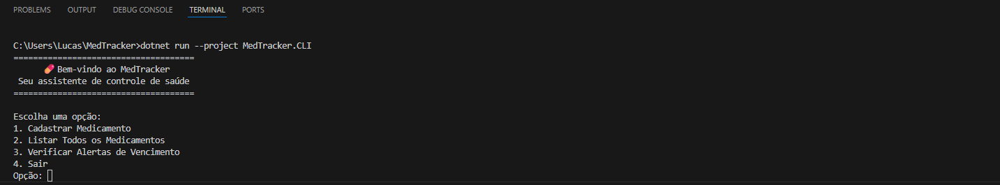

# 💊 MedTracker CLI

[](https://github.com/Yan-neri/MedTracker/actions/workflows/ci.yml)



**🔗 Link do Deploy (Aplicação Publicada):** [Download da Release v1.1.0](https://github.com/Yan-neri/MedTracker/releases/tag/v1.1.0)

---

## 1. Nome do Projeto
**MedTracker CLI** — Sistema de Gerenciamento e Alerta de Validade de Medicamentos.

## 2. Descrição do Problema Real
Cuidadores de idosos e pacientes crônicos enfrentam sérios riscos à saúde devido à falta de controle das datas de validade de medicamentos. O uso acidental de remédios vencidos é um perigo constante, e as ferramentas atuais são muitas vezes complexas demais para o uso rápido no dia a dia.

## 3. Proposta da Solução
Uma ferramenta de linha de comando (CLI) que atua como um validador inteligente. O sistema impede a entrada de medicamentos inválidos e gera alertas proativos. Nesta versão, o sistema consome a API do ViaCEP para buscar automaticamente o endereço das farmácias.

## 4. Público-alvo
Cuidadores familiares, profissionais de saúde domiciliar e pacientes que necessitam de uma ferramenta de inventário simples e segura.

## 5. Funcionalidades Principais
* **Cadastro Validado:** Bloqueio de registros sem nome ou com datas retroativas.
* **Integração com API Externa:** Busca de endereço via CEP (ViaCEP).
* **Inventário Centralizado:** Listagem organizada de todos os itens.
* **Sistema de Alerta:** Avisos para medicamentos que vencem em até 7 dias.

## 6. Tecnologias Utilizadas
* **Linguagem:** C# (.NET 10.0).
* **Integração:** REST API (ViaCEP).
* **Testes:** xUnit (Unidade e Integração).
* **CI/CD:** GitHub Actions e GitHub Releases.

## 7. Instruções de Instalação
Para preparar o ambiente na sua máquina local:
1. Instale o **[Git](https://git-scm.com/downloads)**.
2. Instale o **[.NET SDK 10.0](https://dotnet.microsoft.com/download)**.
3. Clone o repositório:
   ```bash
   git clone [https://github.com/Yan-neri/MedTracker.git](https://github.com/Yan-neri/MedTracker.git)
   ```
4. Acesse a pasta do projeto e restaure as dependências:
   ```bash
   cd MedTracker
   dotnet restore
   ```

## 8. Como Executar a Aplicação (Deploy / CLI)
Como esta é uma aplicação de interface via terminal (CLI), há duas formas de executá-la:

**Opção A: Via Executável (Pronto para Uso)**
Acesse o **[Link do Deploy (Releases)](https://github.com/Yan-neri/MedTracker/releases/tag/v1.1.0)**, baixe o binário correspondente ao seu sistema operacional e execute-o diretamente no terminal.

**Opção B: Via .NET CLI (Código-fonte)**
Com o ambiente de desenvolvimento configurado (Passo 7), abra o terminal na pasta raiz e execute:
```bash
dotnet run --project MedTracker.CLI
```

## 9. Instruções para Rodar os Testes
O projeto conta com testes de unidade e testes de integração (validando a comunicação real com a API ViaCEP). Para executá-los:
```bash
dotnet test
```

## 10. Instruções para Rodar o Lint
Para verificar a formatação e análise estática do código:
```bash
dotnet format --verify-no-changes
```

## 11. Versão Atual
**1.1.0** (Registrada em arquivo `VERSION` e gerada via GitHub Releases).

## 12. Nome do Autor
**Yan Fellipe da Silva Neri** 

## 13. Link do Repositório Público
[https://github.com/Yan-neri/MedTracker](https://github.com/Yan-neri/MedTracker)